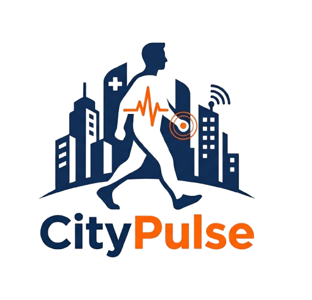

# 🏙️ CityPulse 
**Le Centre de Contrôle Numérique de la Ville Intelligente**

*Une solution interconnectée pour replacer le citoyen au cœur de l'écosystème urbain.*

**🌍 [Accéder à la Plateforme en Ligne (Live Demo)](https://pulse-one-inky.vercel.app/)**

---

## 🚀 Vision & Problématique

Dans un contexte de modernisation des services publics, **CityPulse** répond à quatre défis majeurs de la gestion urbaine :
1.  **Réduction de la Désinformation :** Un canal de communication 100% officiel.
2.  **Réactivité Urbaine :** Signalement géolocalisé immédiat des incidents (fuites, éclairage, voirie).
3.  **Workflow Automatisé :** Dispatching automatique des tâches vers les prestataires compétents.
4.  **Accès aux Urgences :** Centralisation des pharmacies de garde en temps réel.

---

## 🛠️ Stack Technologique (2030 Standard)

Pour garantir une plateforme hautement disponible et évolutive, CityPulse repose sur une **Architecture Découplée (Decoupled Architecture)**.

### **Backend : Le Cœur Logique**
* **Framework :** Laravel 11 | PHP 8.3
* **Architecture :** Service Layer Pattern (Découplage strict de la logique métier).
* **Base de Données :** PostgreSQL (Fiabilité transactionnelle et gestion de données complexes).
* **Sécurité :** Laravel Sanctum (Tokens SPA) & Authentification OTP.
* **Temps Réel :** WebSockets via **Laravel Reverb**.

### **Frontend : L'Expérience Utilisateur**
* **Framework :** React 18 & Vite.js (Approche Mobile-First).
* **Design :** Tailwind CSS 3.4 & Headless UI.
* **Gestion d'État :** Hooks avancés et Context API.

---

## 🎭 L'Écosystème CityPulse (Multi-Acteurs)

CityPulse interconnecte cinq profils pour une boucle de résolution transparente :

| Profil | Rôle Stratégique | Fonctionnalité Clé |
| :--- | :--- | :--- |
| 👤 **Citoyen** | Capteur terrain | Signale les incidents (GPS/Photos) et consulte les infos vitales. |
| 🛡️ **Responsable Secteur** | Coordinateur Local | Valide les incidents de son périmètre (Scope Isolation). |
| 📰 **Journaliste** | Communicant | Gère le flux d'actualités officielles et le planning des pharmacies. |
| 🛠️ **Partenaire** | Exécutant Technique | Reçoit les notifications d'intervention automatiques (ex: RADEES). |
| 👑 **Administrateur** | Pilote Système | Configure les secteurs, les partenaires et le workflow global. |

---

## 🔥 Fonctionnalités Maîtresses (Core Engine)

* 📍 **Moteur de Signalement :** Formulaire en 2 étapes avec détection GPS automatique et preuves visuelles (photos/notes vocales).
* ⚙️ **Dispatching Assisté :** Liaison intelligente `Incident -> Catégorie -> Partenaire` pour une intervention immédiate.
* 🏥 **Pharmacies de Garde Live :** Compte à rebours dynamique calculant le temps restant avant la fermeture de l'officine.
* ⚖️ **Strike System :** Système de modération automatique bannissant les utilisateurs abusifs après 3 signalements.
* 📡 **WebSockets :** Notifications push en temps réel pour le suivi de l'avancement des tickets.

---

## 📅 Planification Agile (Roadmap)

Le projet est piloté selon la méthodologie **Agile Scrum** en 8 Sprints :

- **Sprint 1 :** Modélisation des données & UML.
- **Sprint 2 :** UI/UX Design System & Infrastructure (GitHub/Laravel/Vite).
- **Sprint 3 :** Sécurité, RBAC et système OTP.
- **Sprint 4 :** Moteur de signalement & Espace Citoyen.
- **Sprint 5 :** Dashboard Responsable & Dispatching logique.
- **Sprint 6 :** CMS Actualités & Pharmacies temps réel.
- **Sprint 7 :** WebSockets, Strike System & Modération.
- **Sprint 8 :** QA, Bug fixing, et Préparation à la soutenance.

 
 